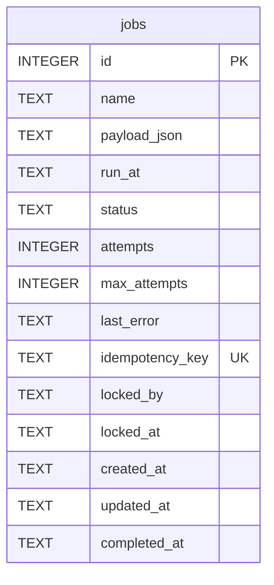

# ZenFlow — Entity Relationship Diagram

> Render at https://mermaid.live — paste the code block below.

---

```mermaid
erDiagram
    THERAPISTS {
        TEXT    id                PK  "t1, t2, ..."
        TEXT    name
        INTEGER telegram_id           "0 until bot activation"
        TEXT    email                 "nullable"
        TEXT    password_hash         "PBKDF2-SHA256 or NULL (Google-only)"
        TEXT    google_id             "Google OAuth sub or NULL"
        TEXT    calendar_name         "default: ZenFlow Availability"
        INTEGER active                "0=false 1=true"
        TEXT    created_at            "datetime('now')"
    }

    APPOINTMENTS {
        INTEGER id                PK  AUTOINCREMENT
        INTEGER patient_id            "Telegram user_id"
        TEXT    patient_name
        TEXT    therapist_id      FK  "→ therapists.id"
        TEXT    date                  "YYYY-MM-DD"
        TEXT    time                  "HH:MM"
        TEXT    status                "active | cancelled (soft delete)"
        TEXT    gcal_apt_event_id     "Google Calendar event id or local_... or NULL"
        TEXT    summary               "AI-generated clinical summary"
        TEXT    created_at
    }

    INTAKE_SESSIONS {
        INTEGER id                PK  AUTOINCREMENT
        INTEGER appointment_id    FK  "→ appointments.id"
        INTEGER patient_id
        TEXT    therapist_id      FK  "→ therapists.id"
        TEXT    history_json          "JSON: [{role, content}, ...]"
        TEXT    created_at
    }

    AVAILABILITY {
        TEXT    id                PK  "uuid4().hex"
        TEXT    therapist_id      FK  "→ therapists.id"
        TEXT    start_dt              "YYYY-MM-DDTHH:MM:SS"
        TEXT    end_dt                "YYYY-MM-DDTHH:MM:SS"
    }

    TREATMENT_NOTES {
        INTEGER id                PK  AUTOINCREMENT
        INTEGER appointment_id    FK  UNIQUE "→ appointments.id (1:1)"
        INTEGER patient_id
        TEXT    tcm_pattern           "e.g. Liver Qi Stagnation"
        TEXT    treatment_principles
        INTEGER diagnosis_certainty   "0–100 (AI confidence %)"
        TEXT    ai_suggested_points   "JSON: [{code, rationale}]"
        TEXT    ai_recommendations    "JSON: {diet, sleep, exercise, stress}"
        TEXT    tongue_observation    "Therapist-entered"
        TEXT    pulse_observation     "Therapist-entered"
        TEXT    session_notes         "Therapist free text"
        TEXT    used_points           "JSON: [ST36, LR3, ...]"
        TEXT    recommendations_sent_at "ISO datetime or NULL"
        TEXT    completed_at          "Set when Complete Session clicked"
        TEXT    created_at
        TEXT    updated_at
    }

    FOLLOWUPS {
        INTEGER id                PK  AUTOINCREMENT
        INTEGER appointment_id    FK  UNIQUE "→ appointments.id (1:1, Phase 6.3)"
        INTEGER patient_id
        TEXT    therapist_id
        TEXT    channel               "telegram | none"
        TEXT    status                "scheduled | sent | in_progress | completed | expired | no_channel"
        TEXT    scheduled_for         "canonical UTC"
        TEXT    sent_at
        TEXT    completed_at
        INTEGER step                  "open question while in progress"
        INTEGER pain_level            "0–10"
        INTEGER improvement_rating    "1–5"
        TEXT    side_effects          "JSON list"
        TEXT    sleep_quality         "worse | same | better"
        TEXT    adherence             "yes | partly | no"
        TEXT    free_text
        TEXT    ai_summary
        INTEGER needs_attention       "red flag"
        TEXT    conversation_json     "JSON transcript"
        TEXT    source                "patient | therapist_manual"
    }

    MESSAGE_LOG {
        INTEGER id                PK  AUTOINCREMENT
        TEXT    ts                    "canonical UTC"
        TEXT    direction             "out (in: Phase 8)"
        TEXT    channel               "telegram | email"
        INTEGER patient_id
        TEXT    therapist_id
        INTEGER appointment_id    FK  "→ appointments.id"
        TEXT    kind                  "recommendations | followup"
        TEXT    status                "sent | failed"
        TEXT    provider_message_id
        TEXT    error                 "redacted, ≤ 300 chars"
    }

    THERAPISTS    ||--o{ APPOINTMENTS       : "treats"
    THERAPISTS    ||--o{ INTAKE_SESSIONS    : "reviews"
    THERAPISTS    ||--o{ AVAILABILITY       : "has slots"
    APPOINTMENTS  ||--o| INTAKE_SESSIONS    : "has one"
    APPOINTMENTS  ||--o| TREATMENT_NOTES   : "has one"
    APPOINTMENTS  ||--o| FOLLOWUPS         : "has one check-in"
    APPOINTMENTS  ||--o{ MESSAGE_LOG       : "messages sent"
```

---

## Table Reference

| Table | PK type | Rows expected | Written by |
|---|---|---|---|
| `therapists` | TEXT (`t1`, `t2`, …) | < 20 | `init_db()`, web registration, bot activation |
| `appointments` | INTEGER AUTOINCREMENT | Thousands | `save_appointment()` |
| `intake_sessions` | INTEGER AUTOINCREMENT | 1:1 with appointments | `save_appointment()` |
| `availability` | UUID hex | Tens–hundreds | Web `/api/availability`, `book_slot()`, `restore_slot()` |
| `treatment_notes` | INTEGER AUTOINCREMENT | 1:1 with appointments | `save_treatment_notes()`, web `/complete` |
| `message_log` | INTEGER AUTOINCREMENT | a few per session | every outbound patient message attempt (6.6) |
| `followups` | INTEGER AUTOINCREMENT | 1:1 with completed appointments | `followup_repo` (enqueue, send, answers, manual entry, start-up backfill) |

---

## Key Constraints

```sql
-- Foreign keys enforced via PRAGMA foreign_keys=ON
appointments.therapist_id  → therapists.id
intake_sessions.appointment_id → appointments.id
intake_sessions.therapist_id   → therapists.id
availability.therapist_id      → therapists.id
treatment_notes.appointment_id → appointments.id UNIQUE
followups.appointment_id       → appointments.id UNIQUE ON DELETE CASCADE

-- No hard deletes on clinical tables
-- appointments.status = 'cancelled' (soft delete)
-- intake_sessions: never deleted
-- treatment_notes: UPSERT only, never deleted
```

---

## Relationship Notes

### `appointments` ↔ `intake_sessions` (1:optional-1)

Every appointment has at most one intake session record. If the patient skipped intake, `history_json` is `'[]'` (empty array). The record is created in the same transaction as the appointment.

### `appointments` ↔ `treatment_notes` (1:optional-1)

`treatment_notes.appointment_id` has a UNIQUE constraint — enforced at the database level. Created at the same time as the appointment (with blank fields for therapist-entered data, AI data populated immediately after intake).

### `therapists` ↔ `availability` (1:many)

Each therapist has their own set of availability slots. The `therapist_id` column in `availability` uses `"default"` as a fallback when no specific therapist is identified (legacy, rarely used).

## Addendum — `jobs` (Phase 1.2)


`jobs` has no foreign keys by design: payloads carry ids (`appointment_id`, `patient_id`) so a
job outlives a soft-deleted row and the table can move to a different store (Phase 12).
